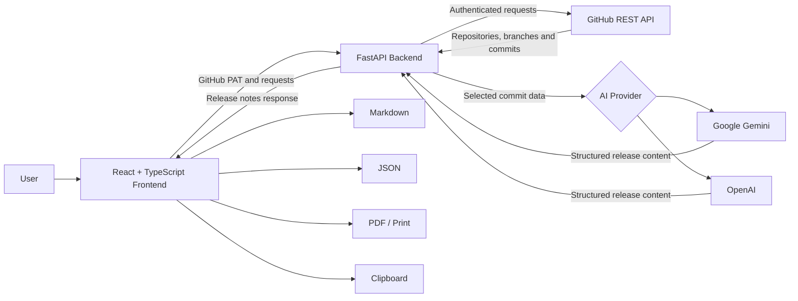

<div align="center">

# 🔭 Relescope

### Your Git history, beautifully summarized.

**AI-powered release notes generated from real GitHub commits.**

Relescope connects to GitHub, loads repository activity, lets you select the commits that matter, and transforms them into structured release notes ready to copy, share, or export.

<br />


<br />

[Features](#-features) •
[Architecture](#-architecture) •
[Quick Start](#-quick-start) •
[Security](#-github-token-security) •
[API](#-api-reference) •
[Roadmap](#-roadmap)

</div>

---

## About Relescope

Release notes are often written manually by reading commit histories, identifying meaningful changes, grouping related work, and rewriting technical messages for users or stakeholders.

Relescope automates that workflow.

It uses live GitHub repository data and AI-assisted classification to generate clear release notes containing:

- Release summaries
- Features
- Bug fixes
- Improvements
- Documentation changes
- Maintenance changes
- Contributors
- Total processed commits

The name **Relescope** combines **release** and **scope**: a clearer view into everything included in a software release.

---

## ✨ Features

| Feature | Description |
|---|---|
| **Live GitHub integration** | Load repositories, branches, commits, authors, and repository metadata from GitHub. |
| **Private repository support** | Connect using a fine-grained GitHub personal access token with read-only access. |
| **Commit selection** | Choose exactly which commits should be included in a release. |
| **Branch selection** | Generate notes from a selected repository branch. |
| **Search and filtering** | Search commits and filter activity by contributor. |
| **Team or individual mode** | Generate release notes for all selected commits or one developer. |
| **AI provider switching** | Use Google Gemini or OpenAI through environment configuration. |
| **Structured output** | Organize changes into features, fixes, improvements, documentation, and maintenance. |
| **Contributor detection** | Build the contributor list from the selected commits. |
| **Multiple exports** | Copy release notes or export them as Markdown, JSON, or PDF. |
| **Responsive interface** | Landing page, secure connection flow, and dashboard work across desktop and mobile layouts. |
| **Interactive API docs** | Test backend endpoints using FastAPI Swagger documentation. |

---

## 🔄 How It Works

1. **Connect GitHub**

   Create a fine-grained, read-only GitHub personal access token and connect it to Relescope.

2. **Choose a repository**

   Load repositories available to your GitHub account, including permitted private repositories.

3. **Select a branch**

   Choose the branch whose commit history should be analysed.

4. **Filter and select commits**

   Search commits, filter by contributor, and select the exact changes to include.

5. **Configure the release**

   Enter the release title, version, environment, and whether the output is for the full team or an individual developer.

6. **Generate release notes**

   Relescope sends the selected commit data to the configured AI provider and returns structured release notes.

7. **Export**

   Copy the result or download it as Markdown, JSON, or PDF.

---

## 🏗 Architecture



### Request flow

```text
Browser
   │
   ├── GitHub token stored in sessionStorage
   │
   ▼
React frontend
   │
   ├── Repository, branch and commit requests
   ▼
FastAPI backend
   │
   ├── GitHub REST API
   └── Gemini or OpenAI API
          │
          ▼
Structured release notes
```

---

## 🧰 Technology Stack

### Frontend

- React 19
- TypeScript
- Vite
- Tailwind CSS
- React Router
- Axios
- Framer Motion
- Motion
- React Icons
- Lucide React
- TanStack Query
- shadcn
- Sonner and React Hot Toast

### Backend

- Python
- FastAPI
- Uvicorn
- Pydantic
- HTTPX
- Google Gen AI SDK
- OpenAI SDK
- Python Dotenv

### External services

- GitHub REST API
- Google Gemini API
- OpenAI API

---

## 📁 Project Structure

```text
relescope/
├── backend/
│   ├── app/
│   │   ├── routers/
│   │   │   ├── github.py
│   │   │   ├── release.py
│   │   │   └── repository.py
│   │   ├── schemas/
│   │   │   ├── github.py
│   │   │   ├── release.py
│   │   │   └── repository.py
│   │   └── services/
│   │       ├── ai_errors.py
│   │       ├── ai_release_service.py
│   │       ├── gemini_release_service.py
│   │       ├── github_service.py
│   │       ├── openai_release_service.py
│   │       └── release_service.py
│   ├── .env.example
│   ├── main.py
│   └── requirements.txt
│
├── frontend/
│   ├── src/
│   │   ├── components/
│   │   │   ├── auth/
│   │   │   ├── dashboard/
│   │   │   ├── landing/
│   │   │   ├── layout/
│   │   │   └── ui/
│   │   ├── context/
│   │   ├── data/
│   │   ├── pages/
│   │   ├── services/
│   │   ├── types/
│   │   ├── utils/
│   │   ├── main.tsx
│   │   └── router.tsx
│   ├── package.json
│   └── package-lock.json
│
├── .gitignore
└── README.md
```

---

## 🚀 Quick Start

### Prerequisites

Install the following before starting:

- Git
- Python
- Node.js and npm
- A GitHub account
- A Google Gemini API key or OpenAI API key

### 1. Clone the repository

```bash
git clone https://github.com/arshad-rahman/relescope.git
cd relescope
```

---

## Backend Setup

### 2. Create a Python virtual environment

```bash
cd backend
python -m venv venv
```

Activate it in Windows Git Bash:

```bash
source venv/Scripts/activate
```

For Linux or macOS:

```bash
source venv/bin/activate
```

### 3. Install backend dependencies

```bash
python -m pip install --upgrade pip
pip install -r requirements.txt
```

### 4. Create the backend environment file

```bash
cp .env.example .env
```

Configure `backend/.env` with at least one AI provider.

#### Gemini configuration

```env
AI_PROVIDER=gemini

GEMINI_API_KEY=your_private_gemini_api_key
GEMINI_MODEL=gemini-3.1-flash-lite
GEMINI_MAX_OUTPUT_TOKENS=5000

OPENAI_API_KEY=
OPENAI_MODEL=gpt-5.5
OPENAI_TIMEOUT_SECONDS=60
OPENAI_MAX_OUTPUT_TOKENS=5000
```

#### OpenAI configuration

```env
AI_PROVIDER=openai

GEMINI_API_KEY=
GEMINI_MODEL=gemini-3.1-flash-lite
GEMINI_MAX_OUTPUT_TOKENS=5000

OPENAI_API_KEY=your_private_openai_api_key
OPENAI_MODEL=gpt-5.5
OPENAI_TIMEOUT_SECONDS=60
OPENAI_MAX_OUTPUT_TOKENS=5000
```

> Never commit `backend/.env` or expose API keys in screenshots, issues, commits, or chat messages.

### 5. Start the backend

Run this command from the `backend` directory:

```bash
uvicorn main:app --reload
```

Backend URLs:

```text
API:          http://127.0.0.1:8000
Health check: http://127.0.0.1:8000/health
Swagger docs: http://127.0.0.1:8000/docs
OpenAPI JSON: http://127.0.0.1:8000/openapi.json
```

---

## Frontend Setup

Open a second terminal:

```bash
cd relescope/frontend
```

### 6. Install frontend dependencies

```bash
npm install
```

### 7. Configure the backend URL

Create `frontend/.env`:

```bash
cat > .env <<'ENV'
VITE_API_URL=http://127.0.0.1:8000/api
ENV
```

### 8. Start the frontend

```bash
npm run dev
```

Open:

```text
http://localhost:5173
```

---

## 🔐 GitHub Token Security

Relescope uses a **fine-grained GitHub personal access token** to read repository information.

### Recommended token configuration

When creating the token:

1. Set an expiration date.
2. Select **Only select repositories**.
3. Choose only the repositories that Relescope should access.
4. Under repository permissions, set **Contents** to **Read-only**.
5. Do not enable write or administration permissions.

Create a fine-grained token:

[GitHub fine-grained token settings](https://github.com/settings/personal-access-tokens/new)

Read GitHub's official guide:

[Managing personal access tokens](https://docs.github.com/en/authentication/keeping-your-account-and-data-secure/managing-your-personal-access-tokens)

### Current security behaviour

- The token is stored in browser `sessionStorage`.
- It is available only to the current browser tab/session.
- It is removed locally when the user disconnects.
- It is sent to the FastAPI backend for authenticated GitHub API requests.
- The current backend implementation does not write the token to a database.
- Relescope does not require repository write or administration permissions.

### Important precautions

- Treat the token like a password.
- Never paste it into GitHub issues, chat messages, emails, or screenshots.
- Use the shortest practical expiration period.
- Revoke the token immediately if it is exposed.
- Use a separate token specifically for Relescope.

> The current token flow is suitable for a local MVP. A public production deployment should replace direct PAT entry with a GitHub App or GitHub OAuth flow.

---

## 🤖 AI Provider Configuration

Relescope supports provider switching through `backend/.env`.

| Provider | Configuration |
|---|---|
| Gemini | `AI_PROVIDER=gemini` |
| OpenAI | `AI_PROVIDER=openai` |

Restart the FastAPI backend after changing providers or models.

### AI output structure

Generated results are grouped into:

```text
Summary
Features
Bug Fixes
Improvements
Documentation
Maintenance
Contributors
Total Commits
```

The selected commits remain the source data for release generation. Relescope also validates commit selection and rejects duplicate commit IDs before generation.

---

## 📦 Export Formats

| Export | Behaviour |
|---|---|
| **Copy** | Copies the generated release notes as Markdown. |
| **Markdown** | Downloads a `.md` release-note file. |
| **JSON** | Downloads structured release-note data as `.json`. |
| **PDF** | Opens a printable release-note layout that can be saved as PDF. |

For PDF export, allow pop-ups if the browser blocks the print window.

---

## 🌐 Application Routes

| Route | Description |
|---|---|
| `/` | Product landing page |
| `/connect` | GitHub connection and PAT security guide |
| `/dashboard` | Protected release-note generation dashboard |

---

## 🔌 API Reference

### General

| Method | Endpoint | Description |
|---|---|---|
| `GET` | `/` | Backend status message |
| `GET` | `/health` | Health check |
| `GET` | `/docs` | Swagger API documentation |
| `GET` | `/openapi.json` | OpenAPI schema |

### Repository

| Method | Endpoint | Description |
|---|---|---|
| `POST` | `/api/repository/validate` | Validate a GitHub repository URL |

### GitHub

| Method | Endpoint | Description |
|---|---|---|
| `POST` | `/api/github/connect` | Validate a GitHub token and load the user |
| `POST` | `/api/github/repositories` | Load accessible repositories |
| `POST` | `/api/github/branches` | Load repository branches |
| `POST` | `/api/github/commits` | Load branch commits |

### Releases

| Method | Endpoint | Description |
|---|---|---|
| `POST` | `/api/releases/generate` | Generate structured AI release notes |

Detailed request and response schemas are available at:

```text
http://127.0.0.1:8000/docs
```

---

## 🧪 Development Commands

### Frontend

```bash
cd frontend

npm run dev
npm run build
npm run lint
npm run preview
```

### Backend

```bash
cd backend
source venv/Scripts/activate

python -m compileall app
uvicorn main:app --reload
```

---

## 🛠 Troubleshooting

### Frontend cannot reach the backend

Confirm:

```env
VITE_API_URL=http://127.0.0.1:8000/api
```

Also confirm that FastAPI is running:

```bash
curl http://127.0.0.1:8000/health
```

Expected:

```json
{
  "status": "healthy"
}
```

### GitHub token is rejected

Check that:

- The token has not expired.
- The intended repository is selected.
- Contents permission is set to read-only.
- The token was copied completely without spaces.
- Organisation approval is complete when required.

### Gemini model returns `404 NOT_FOUND`

The configured model may not be available for the API key. Update:

```env
GEMINI_MODEL=an_available_model_name
```

Restart FastAPI after changing it.

### AI provider returns a quota error

Check the provider account's current API quota, billing status, and rate limits.

### PDF export does not open

Allow pop-ups for the Relescope frontend and try again.

---

## ⚠️ Current Limitations

- Authentication currently uses a manually entered GitHub PAT.
- Tokens are session-based and are not shared across browser tabs.
- Generated releases are not persisted in a database.
- There is no release-history dashboard yet.
- AI generation depends on the configured provider's model availability and quota.
- Backend CORS is currently configured for local frontend development.
- The project does not yet publish generated notes directly to GitHub Releases.

---

## 🗺 Roadmap

- [ ] GitHub App or OAuth authentication
- [ ] Encrypted server-side token handling
- [ ] Release history and database persistence
- [ ] Scheduled weekly and monthly release digests
- [ ] GitHub Release publishing
- [ ] Pull request and issue context
- [ ] Multi-repository release generation
- [ ] Team workspaces
- [ ] Saved release templates
- [ ] Docker-based local environment
- [ ] Automated testing
- [ ] CI/CD pipeline
- [ ] Public cloud deployment
- [ ] Usage analytics and audit logs

---

## 🤝 Contributing

Contributions, suggestions, and bug reports are welcome.

1. Fork the repository.
2. Create a branch:

   ```bash
   git switch -c feature/your-feature-name
   ```

3. Make and test your changes.
4. Commit them:

   ```bash
   git commit -m "feat: describe your change"
   ```

5. Push your branch.
6. Open a pull request.

Never include API keys, personal access tokens, `.env` files, or other credentials in a pull request.

---

## 👤 Author

**Arshad Rahman M P**

DevOps Engineer • Cloud Infrastructure Engineer • Linux System Administrator

- GitHub: [@arshad-rahman](https://github.com/arshad-rahman)
- LinkedIn: [arshad-rahman-mp](https://www.linkedin.com/in/arshad-rahman-mp/)
- Email: [arshadmp004@gmail.com](mailto:arshadmp004@gmail.com)

---

## ⭐ Support

Relescope is a portfolio project built to solve a real developer workflow problem.

Give the repository a star if the project is useful or interesting.

<div align="center">

**Built with GitHub, FastAPI, React, Gemini, and OpenAI.**

</div>
